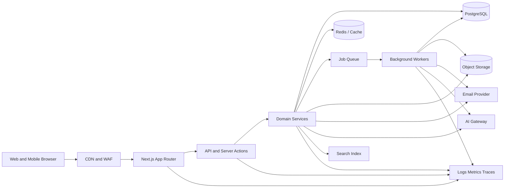

# NEDVI OS Software Architecture

This document defines the target enterprise architecture for NEDVI OS and the boundaries that keep the platform secure, maintainable, observable, and scalable. The current repository is a Next.js 15 foundation. Backend services, persistence, integrations, and infrastructure should be introduced behind the boundaries described here.

All implementation work must follow this document together with [AGENTS.md](AGENTS.md) and [PRODUCT_REQUIREMENTS.md](PRODUCT_REQUIREMENTS.md). Any intentional architectural deviation must be recorded as a technical decision.

## Architecture Goals

NEDVI OS must:

- Provide one dependable operating system for construction companies.
- Support multiple organizations, projects, teams, worksites, and clients.
- Protect tenant data and enforce permissions at every access boundary.
- Keep business workflows traceable from user action to persisted record.
- Support office, mobile, field, and intermittent-connectivity workflows.
- Scale independently across web traffic, background work, files, search, email, and AI usage.
- Remain understandable to engineers and operators as the product grows.
- Prefer reliable managed infrastructure over unnecessary operational complexity.

## System Overview

NEDVI OS follows a modular, service-oriented monolith as its initial production architecture. The web application, domain services, and API contracts live in one deployable codebase while maintaining explicit boundaries. Independent workers and managed infrastructure handle asynchronous or resource-intensive workloads.

This approach keeps early development fast and consistent without coupling the product to a premature microservice topology. A domain can be extracted into an independent service later when its scale, ownership, or operational profile justifies that change.



## Frontend

### Technology

- Next.js 15 with the App Router.
- TypeScript with strict mode.
- React Server Components by default.
- Tailwind CSS for styling and shared design tokens.
- Lucide React for interface icons.
- Accessible semantic HTML and keyboard-first interaction patterns.

### Frontend Responsibilities

The frontend is responsible for presentation, navigation, interaction, optimistic feedback where appropriate, client-side state that improves usability, and invoking typed server or API contracts. It must not be the source of truth for authorization, pricing, financial calculations, or data integrity.

### Rendering Strategy

- Use server components for routes, layouts, data reads, metadata, and static content by default.
- Use client components only for interactive controls, browser APIs, local state, real-time subscriptions, or offline behavior.
- Keep client boundaries narrow. Do not convert an entire route to a client component to support one interactive child.
- Use route-level `loading.tsx`, `error.tsx`, and `not-found.tsx` files where the workflow needs explicit state handling.
- Use Suspense boundaries for independent, slow, or optional dashboard sections.
- Use stable layout constraints to avoid cumulative layout shift.

### Frontend Data Flow

1. The route or server component establishes organization and user context.
2. A typed service or API client requests permitted data.
3. The server validates input and authorization before accessing data.
4. The component renders the result with loading, empty, error, and success states.
5. Mutations revalidate affected paths or invalidate the relevant client cache.

Never expose database credentials, service secrets, privileged tokens, or unrestricted provider responses to the browser.

### Frontend State

- Keep ephemeral state local to the smallest owning client component.
- Use URL search parameters for shareable filters, pagination, and view state.
- Use `src/store` only for cross-route client state that cannot be represented by the URL or server data.
- Treat server data as authoritative. Do not duplicate entire server records in a global client store.
- Make optimistic updates reversible and reconcile them with the server response.

### UI Architecture

- Generic primitives belong in `src/components/ui`.
- Application chrome belongs in `src/components/layout`.
- Domain widgets belong in the relevant domain folder such as `src/components/dashboard`.
- Reuse established components before adding new visual variants.
- Every data-driven surface must define loading, empty, error, and permission-denied behavior as applicable.

## Backend

### Application Boundary

The initial backend is a modular backend-for-frontend inside the Next.js application. Route handlers, server actions, and server-only services provide the boundary while domain modules own the business rules.

The backend must be structured around business capabilities rather than UI pages:

- Identity and organization management
- Clients and CRM
- Projects and construction sites
- Quotations and purchasing
- Inventory and suppliers
- Human resources
- Accounting
- Calendar and tasks
- Documents and files
- Emails and notifications
- Reports and analytics
- Coral AI
- Administration and audit

### Service Layers

Each domain should follow this dependency direction:

```text
Route handler / server action
  -> Request validation and authorization
  -> Application service / use case
  -> Domain rules and entities
  -> Repository or provider interface
  -> Database or external integration
```

- **Transport layer:** Maps HTTP or server action input to typed application requests and output to safe responses.
- **Application layer:** Coordinates a use case, transaction, authorization context, and side effects.
- **Domain layer:** Owns business rules, state transitions, invariants, and domain types.
- **Infrastructure layer:** Implements database repositories, storage providers, email providers, queues, search, and external APIs.

Domain logic must not depend on React components or browser APIs. External providers must be accessed through interfaces so they can be replaced, tested, and configured per environment.

### Background Processing

Use background jobs for work that is slow, retryable, large, or not required to complete the user request synchronously:

- PDF generation
- File scanning and image processing
- Email delivery and synchronization
- Notification fan-out
- Search indexing
- Report generation
- AI document ingestion and long-running requests
- Data imports and exports
- Scheduled reminders and recurring tasks

Jobs must be idempotent, observable, retryable with backoff, and safe to run more than once.

## Database

### Primary Database

Use managed PostgreSQL as the system of record. PostgreSQL is appropriate for relational construction data, financial records, permissions, audit history, reporting queries, and transactional integrity.

Use a typed migration and query layer. The selected ORM or query builder must:

- Generate and review migrations explicitly.
- Support transactions and constraints.
- Make tenant and permission filters difficult to omit.
- Expose typed query results.
- Work with connection pooling in serverless or container environments.

### Data Modeling Principles

- Every organization-owned record must include an organization or tenant scope.
- Use stable IDs generated server-side. Do not expose sequential IDs where they create enumeration risk.
- Model relationships explicitly between clients, projects, sites, users, documents, and financial records.
- Store money as integer minor units with an explicit currency. Never use floating point for financial values.
- Store timestamps in UTC and render them in the user's configured time zone.
- Use state machines or constrained status values for important workflows.
- Add created, updated, created-by, and updated-by metadata where auditability requires it.
- Use soft deletion only where recovery, audit, or legal retention requires it. Do not hide deleted data from audit trails.
- Add indexes for tenant scope, foreign keys, status, date range, and common search or report filters.
- Use database constraints for uniqueness, referential integrity, valid ranges, and required relationships.

### Read and Write Patterns

- Use transactions for multi-record business operations.
- Keep read models or materialized summaries for expensive dashboards and reports when needed.
- Use an outbox pattern for reliable events emitted alongside database changes.
- Never update financial or auditable records through an untracked direct mutation.
- Separate operational tables from analytics workloads as usage grows.

## Authentication

Authentication establishes identity. Authorization decides what that identity can do.

### Requirements

- Use a standards-based identity provider with OIDC support and a path to SAML SSO for enterprise customers.
- Support secure email and password authentication where required, with MFA readiness and password recovery.
- Use short-lived access tokens or sessions with secure rotation.
- Store session cookies as `HttpOnly`, `Secure`, and appropriate `SameSite` values.
- Never store authentication tokens in localStorage.
- Support session revocation, logout from other devices, and suspicious-session review.
- Record authentication events in the audit system.
- Apply rate limiting and account protection to login, recovery, verification, and invitation flows.

### Authorization Model

Use layered authorization:

1. **Tenant scope:** The user belongs to the organization owning the resource.
2. **Role permissions:** The user's role allows the module and action.
3. **Resource scope:** The user can access the specific project, site, record, or file.
4. **State rules:** The requested transition is valid for the record's current state.
5. **Data sensitivity:** Sensitive HR, accounting, client, and security data receives additional restrictions.

Authorization must be enforced in backend services and APIs. Hiding a frontend button is never sufficient.

## API

### API Style

Use versioned REST APIs for external integrations, mobile clients, and stable machine-to-machine access. Use internal server actions or server-side service calls for tightly coupled web interactions when they provide a clear benefit.

The public API should be organized under `/api/v1` and use resource-oriented routes. For example:

```text
GET    /api/v1/projects
POST   /api/v1/projects
GET    /api/v1/projects/:projectId
PATCH  /api/v1/projects/:projectId
GET    /api/v1/projects/:projectId/documents
POST   /api/v1/projects/:projectId/activities
```

### API Standards

- Validate every request at the boundary with shared schemas.
- Return consistent success and error envelopes.
- Use correct HTTP status codes.
- Include request IDs for support and observability.
- Enforce authentication, authorization, tenant scope, and rate limits on every protected route.
- Support pagination, filtering, sorting, and explicit field selection for collection endpoints.
- Use idempotency keys for retryable financial, purchasing, upload, and external-integration mutations.
- Version breaking changes; do not silently change response contracts.
- Never return internal stack traces, provider secrets, or unauthorized fields.
- Generate and maintain an OpenAPI specification for public integrations.

## File Storage

Use private, managed object storage compatible with S3 APIs as the source of truth for documents, images, site photos, generated PDFs, and email attachments.

### File Flow

1. The backend authorizes the intended resource and upload metadata.
2. The backend creates a short-lived signed upload URL or controlled upload session.
3. The client uploads directly to private object storage.
4. A completion event creates or updates the database file record.
5. A worker scans, validates, extracts metadata, and creates previews or thumbnails.
6. Downloads use short-lived signed URLs after a fresh authorization check.

### Storage Standards

- Store file metadata in PostgreSQL and bytes in object storage.
- Keep tenant and resource scope in both metadata and object keys.
- Validate size, MIME type, extension, and content signature.
- Scan uploads for malware and reject unsafe content.
- Use immutable or versioned objects when audit and document history require it.
- Apply retention, deletion, backup, and legal-hold policies.
- Do not expose provider bucket URLs directly as permanent public links.

## Email Service

Use a transactional email provider for system email and a provider integration layer for connected user mailboxes.

### Transactional Email

Transactional email includes invitations, authentication messages, quote delivery, approvals, reminders, notifications, and operational alerts. Email delivery must be asynchronous, templated, localized when required, and tracked with provider message IDs.

### Connected Email

Connected mailbox workflows must use OAuth or provider-approved authentication. Store refresh tokens encrypted, request only the scopes required, and support revocation. Associate conversations with permitted clients, projects, quotes, suppliers, and tasks without copying more data than needed.

### Email Reliability

- Use a queue and retry policy.
- Make sends idempotent.
- Record delivery, bounce, complaint, and failure events.
- Protect against duplicate sends.
- Sanitize rendered content and attachments.
- Do not place sensitive information in subject lines or insecure logs.

## AI Service

Coral is accessed through an internal AI gateway rather than directly from UI components. The gateway provides a stable interface over one or more model providers.

### AI Gateway Responsibilities

- Authenticate the requesting user and organization.
- Apply permissions before retrieving context.
- Minimize and redact sensitive data sent to models.
- Retrieve relevant documents and records through permission-aware search.
- Apply model, token, cost, timeout, and rate policies.
- Validate structured outputs against schemas.
- Record prompts, source references, model metadata, latency, and outcome according to privacy policy.
- Support provider fallback without exposing provider-specific contracts to the product.

### AI Safety

- Coral must never bypass permissions or expose cross-tenant information.
- Responses must distinguish verified records from generated suggestions.
- Important answers should cite the records, documents, or time range used.
- High-impact actions such as financial changes, approvals, deletion, or external communication require explicit user confirmation.
- Protect against prompt injection in uploaded documents, emails, and external content.
- Provide timeout, refusal, uncertainty, and provider-failure states.
- Maintain retention and deletion policies for prompts and outputs.

## Deployment

### Environments

Maintain separate environments with separate credentials and data boundaries:

- **Local:** Developer machine with safe local or sandbox dependencies.
- **Preview:** Ephemeral branch or pull-request environment with non-production data.
- **Staging:** Production-like environment used for integration, acceptance, and migration rehearsals.
- **Production:** Protected customer environment with managed services, monitoring, backups, and controlled releases.

### Runtime

Deploy the Next.js application as a reproducible container or managed Next.js runtime. Use managed PostgreSQL, object storage, cache, queue, email, and observability services. Keep long-running background workers separate from web request processes.

Configuration must be supplied through environment variables or a managed secret system. Validate required configuration during startup and fail clearly when a required production secret is missing.

### Reliability

- Use health and readiness checks.
- Configure timeouts and graceful shutdown.
- Keep web requests bounded and move long tasks to workers.
- Provide database backups, point-in-time recovery, and tested restore procedures.
- Define recovery point and recovery time objectives for critical data.
- Use infrastructure as code for production resources where possible.
- Document incident response, rollback, and disaster recovery procedures.

## CI/CD

Use GitHub Actions or an equivalent protected CI platform.

### Pull Request Checks

Every pull request should run:

1. Dependency installation from the lockfile.
2. Formatting validation where configured.
3. ESLint.
4. TypeScript type checking.
5. Unit and component tests.
6. Build validation.
7. Dependency and secret scanning.
8. Migration validation when database changes are present.

### Release Flow

- Pull requests are reviewed before merge.
- The default branch must remain buildable.
- Merges produce a preview or staging deployment.
- Production deployment requires protected approval and successful checks.
- Database migrations run as an explicit, observable release step.
- Deployments should support rollback to the previous application version.
- Keep release notes and migration notes for operationally significant changes.

Never run destructive production migrations automatically without a reviewed migration plan and backup strategy.

## Security

Security is a system property, not a single authentication feature.

### Application Security

- Validate and authorize all input server-side.
- Use parameterized queries or a safe typed data layer.
- Protect against XSS, CSRF, SSRF, injection, insecure direct object references, and unsafe file uploads.
- Apply secure response headers, including an appropriate Content Security Policy where practical.
- Use rate limits on authentication, APIs, uploads, exports, search, and AI operations.
- Avoid leaking record existence through unauthorized error differences.
- Redact secrets and personal data from logs and traces.

### Data Security

- Encrypt data in transit with TLS and at rest through managed provider controls.
- Encrypt sensitive tokens and credentials at the application layer before persistence.
- Enforce tenant isolation in services and database access patterns.
- Apply least privilege to users, service accounts, workers, and CI jobs.
- Define retention, deletion, export, and legal-hold behavior.
- Protect backups with separate access controls and encryption.

### Operational Security

- Store secrets in a managed secret store, never in source control.
- Scan dependencies and container images for known vulnerabilities.
- Monitor authentication anomalies, permission changes, export activity, and sensitive record access.
- Maintain audit logs that are access-controlled and tamper-evident.
- Review third-party integrations and scopes before production use.
- Maintain a security incident response process.

## Observability

Every production request and background job should be diagnosable without exposing sensitive data.

- Use structured logs with request, organization, user, job, and resource identifiers where appropriate.
- Use metrics for latency, error rate, throughput, queue depth, delivery rate, storage failures, and AI usage.
- Use distributed traces across web requests, services, database calls, queues, and providers where supported.
- Track business health metrics such as quote conversion, project risk, overdue tasks, and failed integrations.
- Define alerts with owners, thresholds, runbooks, and escalation paths.
- Provide user-facing status and request IDs for support investigations.

## Folder Structure

The repository follows this structure. New layers should be added only when their ownership and deployment boundary are clear.

```text
/
  AGENTS.md
  ARCHITECTURE.md
  PRODUCT_REQUIREMENTS.md
  package.json
  next.config.ts
  tsconfig.json
  src/
    app/
      (auth)/
        login/
      (dashboard)/
        dashboard/
      api/
        v1/
    components/
      ui/
      layout/
      auth/
      dashboard/
    config/
    features/
      crm/
      clients/
      projects/
      sites/
      quotations/
      inventory/
      purchasing/
      hr/
      accounting/
      documents/
      email/
      reports/
      notifications/
      ai/
    hooks/
    lib/
      auth/
      validation/
      logging/
      formatting/
    services/
      database/
      storage/
      email/
      search/
      ai/
      queue/
    store/
    styles/
    types/
  workers/
  migrations/
  tests/
    unit/
    integration/
    e2e/
  infrastructure/
  .github/
    workflows/
```

The exact physical arrangement may evolve, but ownership boundaries must remain explicit. Avoid circular imports between domain modules. Shared types should not become a dumping ground for domain behavior.

## Coding Standards

- Use TypeScript strict mode and typed contracts at every boundary.
- Prefer server components and server-side service calls by default.
- Use named exports for reusable components and default exports for Next.js route entry points where required.
- Use PascalCase for components, camelCase for functions and variables, and `use` prefixes for hooks.
- Keep domain rules in domain services, not route files or UI components.
- Validate external input at the boundary and return safe, typed errors.
- Keep money in integer minor units and dates in UTC internally.
- Make background jobs idempotent and retryable.
- Add tests for authorization, state transitions, financial calculations, integrations, and shared UI behavior.
- Keep loading, empty, error, and permission-denied states explicit.
- Avoid `any`, hidden global state, duplicated primitives, and unnecessary dependencies.
- Preserve existing architecture and limit unrelated changes.
- Use conventional commits in the form `type(scope): imperative summary`.
- Run lint, type checks, tests, and a production build before release.

## Architectural Decision Rules

When choosing between approaches:

1. Preserve tenant isolation and authorization correctness.
2. Preserve data integrity and auditability.
3. Prefer the simplest design that meets current scale and reliability needs.
4. Keep provider integrations behind replaceable interfaces.
5. Prefer reversible decisions and explicit migration paths.
6. Optimize for user workflows and operational clarity.
7. Record decisions that alter a documented boundary, data contract, security posture, or deployment model.

NEDVI OS is production-ready when its code, data, security, operations, and user experience are dependable together. A feature is not complete merely because its UI renders; it must respect the architecture, permissions, observability, failure modes, and lifecycle described here.
